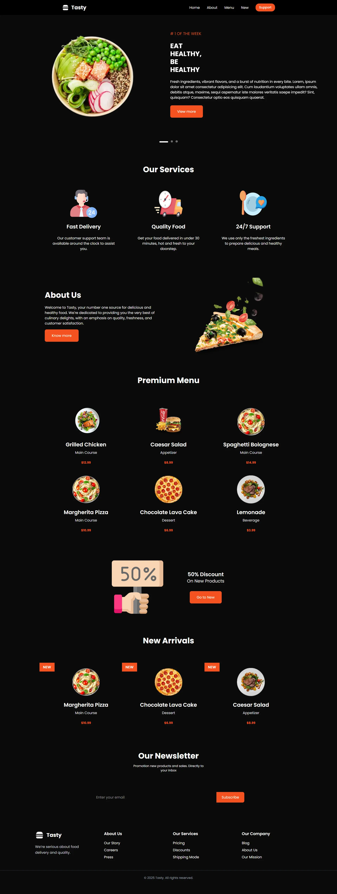

# 🌐 Tasty Restaurant Landing Page  

  
*Screenshot of the Tasty Restaurant Landing Page*

---

## 🚀 Description

**Tasty Landing Page** is a **modern, responsive, and visually appealing landing page** built for a restaurant named Tasty.  
It’s designed to showcase the restaurant’s, increase user engagement, and provide a seamless user experience across all devices.  

This landing page is built with:  

- **Vue 3 + TypeScript** for a scalable and type-safe frontend  
- **Vite** for fast development and optimized builds  
- **TailwindCSS v4** for modern, responsive, and flexible design  
- **Swiper.js** for testimonials and carousel sliders  
- **Fontawesome Icons** for crisp and lightweight icons  
- **Reusable Vue components** for maintainable and clean code  

**Included sections:**  

- Header section with menu highlights and CTA buttons  
- Features / Services overview  
- About Section  
- Premium Menu  
- News Arrivals  
- Newsletter
- Modern, responsive footer

---

## 💻 Installation

1. **Clone the repository:**

```bash
git clone git@github.com:MHTech229/mht-tasty-landing-page.git
cd mht-tasty-landing-page
```
2. **Install dependencies:**

```bash
Copy the code
npm install
# or
yarn install
```
**⚡ Development**

```bash
Copy the code
npm run dev
# or
yarn dev
```
Open http://localhost:5173 in your browser.
Code changes are instantly reflected thanks to Vite.

## 📦 Available Scripts
In the project directory, you can run:

npm run dev – Start development server

npm run build – Build project for production

npm run preview – Preview the production build

npm run lint – Run ESLint checks

## 🌐 Deployment
This project can be deployed on Vercel, Netlify, Render, or any static hosting provider.

## 📦Build for production:

```bash
Copy the code
npm run build
# or
yarn build
```
The dist folder is ready to be deployed.

## 🏗️ Project Structure
```bash
Copy the code
src/
├─ assets/           # Images, icons, and SVGs
├─ components/       
│  ├─ containers/    # Header, About, NewsArrivals, Newsletter, PremiumMenu, Services, Discount
│  └─ ui/            # Buttons, Navbar, Footer
├─ App.vue           # Main Vue entry
├─ main.ts           # Vue initialization
└─ style.css         # TailwindCSS + global styles
```

## 🛠️ Tech Stack

---

* **Vue 3 & TypeScript**

* **Vite**

* **TailwindCSS v4**

* **Swiper.js**

* **Fontawesome Icons**

---

👨‍💻 Author
* **MEHINTO Charbel** – Développeur Fullstack – [LinkedIn](https://www.linkedin.com/in/ange-marie-charbel-mehinto/)